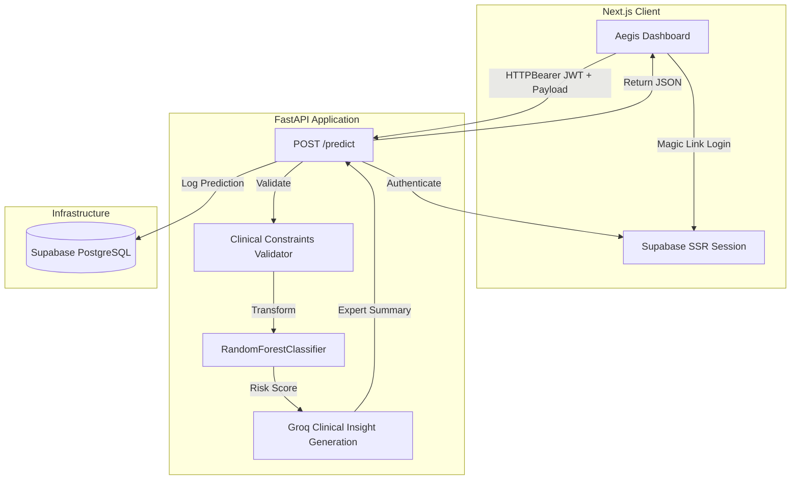
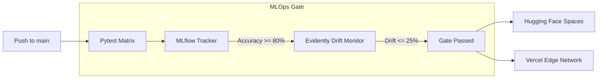

<div align="center">
  
  
  # Aegis Heart Disease Platform
  
  **Enterprise-Grade AI/ML Platform for Cardiovascular Risk Stratification**
  
  [](https://www.python.org)
  [](https://nextjs.org)
  [](https://fastapi.tiangolo.com)
  [](https://supabase.com)
  [](https://scikit-learn.org/)
  [](https://mlflow.org)
  []()
  []()
</div>

---

A complete, production-ready full-stack AI platform built to classify heart disease risk from clinical vitals. Aegis bridges the gap between raw data science and enterprise engineering, combining a rigorously validated **Scikit-Learn** ML pipeline, a **FastAPI** inference backend, a **Next.js** frontend dashboard, and a fortified **MLOps** continuous deployment gate utilizing **Evidently AI**, **MLflow**, and **DagsHub**.

## Table of Contents

- [Features](#features)
- [Architecture](#architecture)
- [Project Structure](#project-structure)
- [Tech Stack](#tech-stack)
- [Installation & Quick Start](#installation--quick-start)
- [Configuration](#configuration)
- [API Documentation](#api-documentation)
- [MLOps Surveillance System](#mlops-surveillance-system)
- [Continuous Integration / Continuous Deployment (CI/CD)](#continuous-integration--continuous-deployment-cicd)
- [Docker](#docker)
- [Testing](#testing)
- [Security](#security)
- [Contributing](#contributing)
- [License](#license)

---

## Features

| Feature | Description |
| :--- | :--- |
| **🔐 Passwordless Auth** | Seamless magic-link email authentication powered by Supabase SSR. |
| **🛡️ Strict Validation** | Pydantic enforces clinical boundary limits (e.g., age, cholesterol) *before* inference. |
| **🧠 ML Inference** | Baseline RandomForest pipeline trained on the UCI Cleveland Dataset (accuracy > 80%). |
| **💬 Groq LLM Insights** | Automatically generated expert clinical summaries via Groq's high-speed inference. |
| **📉 Drift Surveillance** | Automated Evidently AI monitors detecting feature drift > 25% against baseline data. |
| **📊 Experiment Tracking** | MLflow logging routed to remote DagsHub servers, featuring programmatic gating. |
| **🌗 Premium UI/UX** | Matte enterprise dashboard with pristine dark/light mode toggling via TailwindCSS v4. |
| **🚀 Automated CI/CD** | Full GitHub Actions pipeline blocking deployments on failed tests or ML deterioration. |

---

## Architecture

### System Architecture & Request Lifecycle



### MLOps & CI/CD Pipeline



---

## Project Structure

```text
heart-disease-platform/
├── .github/
│   └── workflows/
│       └── production-release.yml  # Strict CI/CD pipeline and MLOps deployment gate
├── backend/
│   ├── app/
│   │   ├── main.py                 # FastAPI application, lifespans, and endpoints
│   │   ├── schemas.py              # Pydantic models for strict clinical validation
│   │   └── llm.py                  # Groq client integration for clinical insights
│   ├── tests/
│   │   └── test_pipeline.py        # 11-point Pytest matrix for model and validation
│   ├── Dockerfile                  # Containerization for Hugging Face deployment
│   ├── drift_monitor.py            # Evidently AI automated drift surveillance script
│   ├── mlflow_tracker.py           # DagsHub MLflow tracking with programmatic gating
│   └── heart_disease_model.pkl     # Serialized Scikit-Learn Pipeline
├── frontend/
│   ├── src/
│   │   ├── app/                    # Next.js App Router (pages, layouts, auth callbacks)
│   │   ├── components/             # Reusable UI components (PatientForm, Header, etc.)
│   │   ├── lib/                    # API client and type definitions
│   │   └── utils/                  # Supabase SSR client utilities
│   ├── tailwind.css                # Global styles and Tailwind v4 configuration
│   └── package.json                # Frontend dependencies
├── model-training/
│   └── train_baseline.py           # Reproducible Jupyter/Colab script for model creation
├── supabase_schema.sql             # PostgreSQL DDL and Row Level Security policies
└── README.md                       # You are here
```

---

## Tech Stack

| Category | Technology |
| :--- | :--- |
| **Frontend Framework** | Next.js 16 (App Router), React 19, TypeScript |
| **Styling** | TailwindCSS v4, Lucide React (Icons) |
| **Backend API** | FastAPI, Uvicorn, Pydantic |
| **Machine Learning** | Scikit-Learn 1.6.1, Pandas, Numpy, XGBoost |
| **LLM Inference** | Groq Python SDK |
| **Database & Auth** | Supabase (PostgreSQL), Next.js SSR Auth, Row Level Security |
| **MLOps & Tracking** | Evidently AI, MLflow, DagsHub |
| **CI/CD & Deployment** | GitHub Actions, Vercel, Hugging Face Spaces (Docker) |

---

## Installation & Quick Start

### 1. Clone the Repository
```bash
git clone https://github.com/engrmaziz/heart-disease-platform.git
cd heart-disease-platform
```

### 2. Database Setup (Supabase)
1. Create a new project in [Supabase](https://supabase.com/).
2. Navigate to the SQL Editor and run the entire contents of [`supabase_schema.sql`](./supabase_schema.sql) to initialize the `aegis_predictions` table and strict RLS policies.
3. Configure Email Auth (Magic Links) in the Supabase Authentication dashboard.

### 3. Backend Setup
```bash
cd backend
python -m venv venv
source venv/bin/activate  # On Windows: venv\Scripts\activate
pip install -r requirements.txt
```

### 4. Frontend Setup
```bash
cd frontend
npm install
```

---

## Configuration

You must configure the following environment variables before running the application locally.

### Backend (`backend/.env`)

| Variable | Required | Description |
| :--- | :--- | :--- |
| `GROQ_API_KEY` | **Yes** | Authenticates with Groq for generating clinical insights. |
| `SUPABASE_URL` | **Yes** | Your Supabase Project URL. |
| `SUPABASE_KEY` | **Yes** | Supabase Anon Key (or Service Role Key for background scripts). |
| `MLFLOW_TRACKING_URI` | No | Full DagsHub MLflow URI (e.g., `https://dagshub.com/...`) |
| `MLFLOW_TRACKING_USERNAME` | No | DagsHub Username. |
| `MLFLOW_TRACKING_PASSWORD` | No | DagsHub access token. |

### Frontend (`frontend/.env.local`)

| Variable | Required | Description |
| :--- | :--- | :--- |
| `NEXT_PUBLIC_SUPABASE_URL` | **Yes** | Your Supabase Project URL. |
| `NEXT_PUBLIC_SUPABASE_ANON_KEY` | **Yes** | Supabase Anon Key. |
| `NEXT_PUBLIC_API_URL` | **Yes** | Defaults to `http://localhost:8000` for local development. |

### Running Locally
1. **Start the Backend:**
   ```bash
   cd backend
   uvicorn app.main:app --reload --port 8000
   ```
2. **Start the Frontend:**
   ```bash
   cd frontend
   npm run dev
   ```
Navigate to `http://localhost:3000` to log in via Magic Link and access the dashboard.

---

## API Documentation

The FastAPI backend automatically generates interactive OpenAPI documentation.
Once running, visit: `http://localhost:8000/docs`.

### `POST /predict`
Runs inference on patient data and returns a probability score alongside an LLM-generated clinical insight.

**Authentication:** Requires `Authorization: Bearer <Supabase_JWT>` header.

**Payload Example:**
```json
{
  "age": 55,
  "sex": 1,
  "cp": 2,
  "trestbps": 130,
  "chol": 250,
  "fbs": 0,
  "restecg": 0,
  "thalach": 150,
  "exang": 0,
  "oldpeak": 1.5,
  "slope": 1,
  "ca": 0,
  "thal": 2
}
```

**Response Example:**
```json
{
  "prediction": 1,
  "confidence": 0.87,
  "risk_level": "High Risk",
  "clinical_insight": "The patient's elevated resting blood pressure and age increase their cardiovascular risk. A lifestyle intervention is recommended."
}
```

---

## MLOps Surveillance System

The Aegis platform utilizes an automated, highly-opinionated MLOps gate to prevent model degradation from reaching production.

1. **Drift Monitoring (`drift_monitor.py`)**
   - Automatically downloads the pristine UCI Cleveland dataset as a baseline reference.
   - Queries the last 100 predictions directly from the production Supabase database.
   - Analyzes core features (`age`, `trestbps`, `chol`) using an **Evidently AI** `DataDriftPreset`.
   - **Gate:** If statistically significant drift exceeds **25%**, the script aborts via a Python `AssertionError`, halting the CI/CD pipeline.

2. **Experiment Tracking (`mlflow_tracker.py`)**
   - Automatically logs hyperparameter configurations and test metrics to a remote **DagsHub / MLflow** server.
   - **Gate:** Intercepts the logging attempt. If the baseline accuracy drops below **0.80 (80%)**, it raises a `ValueError`, crashing the deployment pipeline to maintain production integrity.

---

## Continuous Integration / Continuous Deployment (CI/CD)

Located at `.github/workflows/production-release.yml`, the pipeline enforces the strict Aegis standard on every push to `main`.

1. **Test Job**: Provisions an isolated Ubuntu container, installs dependencies, and executes the 11-point Pytest matrix against the FastAPI backend, asserting structural, boundary, and vulnerability invariance.
2. **MLOps Gate**: Dependent on testing. Runs the Drift Monitor and MLflow tracker. Any detected anomaly or degradation completely terminates the workflow.
3. **Deploy Backend**: Upon passing the MLOps Gate, authenticates via Hugging Face CLI and pushes the `/backend` payload to a Hugging Face Space.
4. **Deploy Frontend**: Concurrently uses the Vercel Action to build and deploy the Next.js frontend to the Edge Network with enforced production flags.

---

## Docker

The backend includes a highly optimized Dockerfile tailored for standard containerized deployment (e.g., Hugging Face Spaces, AWS ECS, Google Cloud Run).

```bash
cd backend
docker build -t aegis-backend .
docker run -p 7860:7860 -e GROQ_API_KEY=your_key aegis-backend
```

*Note: The Dockerfile exposes port `7860` as required by Hugging Face Spaces environments.*

---

## Testing

A highly rigorous, 11-point validation matrix covers the backend inference pipeline, simulating out-of-bound variables, pathological constraints, pipeline determinism, and multi-row batch execution.

```bash
cd backend
pytest tests/ -v
```

---

## Security

- **Row Level Security (RLS)**: PostgreSQL ensures that regardless of API vulnerability, user data remains strictly isolated at the database engine level.
- **Strict Pydantic Constraints**: Erroneous, pathological, or malicious data shapes are discarded instantly via FastAPI's intrinsic validation, preventing poison attacks against the Random Forest.
- **Stateless Inference**: The ML model resides purely in memory; user payloads are evaluated ephemerally.

---

## Contributing

We welcome contributions to the Aegis Heart Disease Platform! Please ensure that:
1. All changes pass the existing Pytest matrix.
2. If introducing new features, accompanying tests are written to maintain 100% coverage on critical paths.
3. Code conforms to standard Python/TypeScript formatting guidelines.
4. Pull requests are opened against the `main` branch with descriptive intent.

---

## License

This project is open-source and available under the [MIT License](./LICENSE).

---
<div align="center">
  <i>Engineered for Reliability. Built for the Future of Healthcare AI.</i>
</div>
